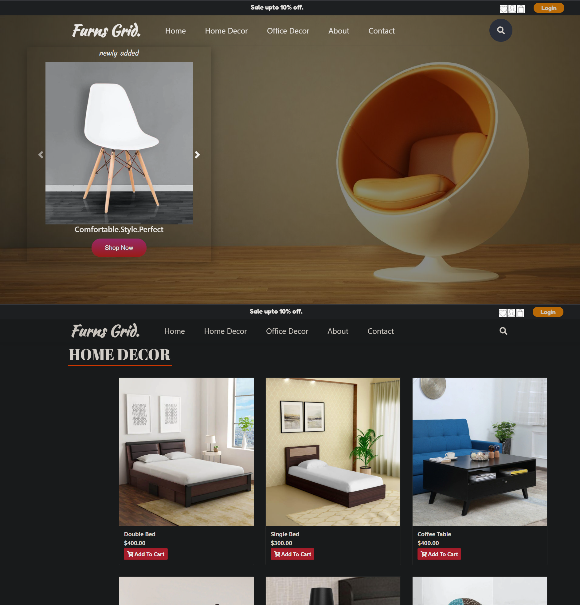

# Furns_Grid

<br/>
<p align="center">
  <a href="https://github.com/faizm55212/furns_grid">
    
  </a>

  <h3 align="center">FurnsGrid</h3>

  <p align="center">
    E commerce Webpage for Furnitures
    <br/>
    <br/>
    <a href="https://github.com/faizm55212/furns_grid/issues">Report Bug</a>
    .
    <a href="https://github.com/faizm55212/furns_grid/issues">Request Feature</a>
  </p>
</p>

    

## About The Project



As for now, India has the highest growth rate of internet users, and has the internet user base of 627 million as of December 2019, about 50% of the total population. Still the penetration of E-commerce is pretty low if compared to countries like United States and France, but is growing, adding over 6 million new entrants every month.

With the recession being a thing of past, the furniture and homeware industry is a good indicator of how the housing market largely recovered its losses. However, furniture and home décor producers face new challenges posed by the digital transformation as an increasing number of consumers turn to the internet in search of their new candelabra. Can home and kitchen brands survive by relying solely on traditional distribution channels?

A list of commonly used resources that I find helpful are listed in the acknowledgements.

## Built With

This App is built with:

* [Bootstrap](https://getbootstrap.com/)
* [NODEJS](https://nodejs.org/)


### Installation

1. Clone the repo

```sh
git clone https://github.com/faizm55212/furns_grid.git
```

4. Send you feedbacks


## Roadmap

See the [open issues](https://github.com/faizm55212/furns_grid/issues) for a list of proposed features (and known issues).

## Contributing

Contributions are what make the open source community such an amazing place to be learn, inspire, and create. Any contributions you make are **greatly appreciated**.
* If you have suggestions for adding or removing projects, feel free to [open an issue](https://github.com/faizm55212/furns_grid/issues/new) to discuss it, or directly create a pull request.
* Please make sure you check your spelling and grammar.
* Create individual PR for each suggestion.

### Creating A Pull Request

1. Fork the Project
2. Create your Feature Branch (`git checkout -b feature/AmazingFeature`)
3. Commit your Changes (`git commit -m 'Add some AmazingFeature'`)
4. Push to the Branch (`git push origin feature/AmazingFeature`)
5. Open a Pull Request

## License

Distributed under the MIT License. See [LICENSE](https://github.com/faizm55212/furns_grid/blob/main/LICENSE.md) for more information.

## Authors

* **Faiz Khan** - *Comp Sci Student* - [Faiz Khan](https://github.com/faizm55212/) 
